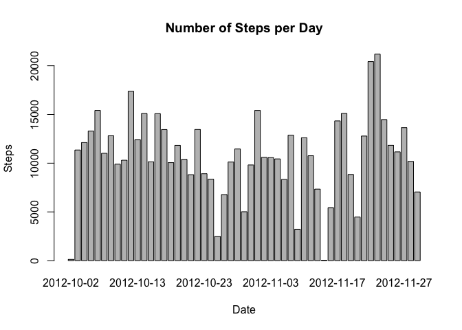
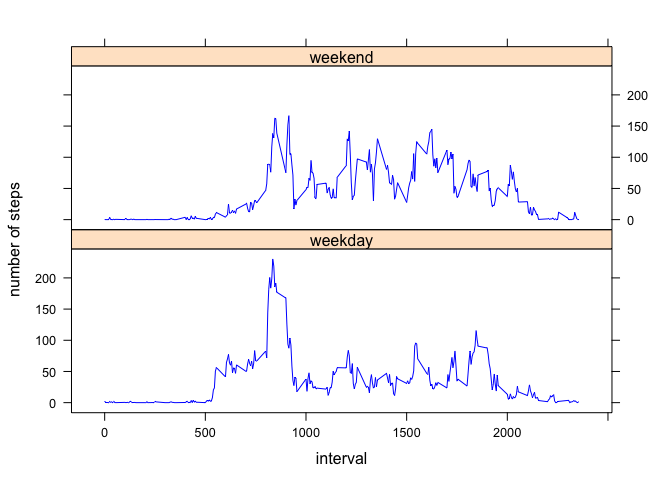

# Reproducible Research: Peer Assessment 1

## Loading and preprocessing the data

```r
activity<-read.csv("activity.csv" , header=TRUE)
library(lattice) 
activity$date<-as.Date(activity$date,format = '%Y-%m-%d')
activity<-read.csv("activity.csv" , header=TRUE)
Total_Steps_By_Day <-aggregate(steps~date, data=activity,sum, na.rm=TRUE)
head(Total_Steps_By_Day)
```

```
##         date steps
## 1 2012-10-02   126
## 2 2012-10-03 11352
## 3 2012-10-04 12116
## 4 2012-10-05 13294
## 5 2012-10-06 15420
## 6 2012-10-07 11015
```

## What is mean total number of steps taken per day?

```r
barplot(Total_Steps_By_Day$steps, names.arg =Total_Steps_By_Day$date, main="Number of Steps per Day",xlab="Date", ylab="Steps")
```

 

## On average, the number of steps taken per day is 1.0766189 × 104 and the median is 10765

## What is the average daily activity pattern?

```r
activity<-read.csv("activity.csv" , header=TRUE)
Average_Steps_By_Interval <-aggregate(steps~ interval , data=activity,mean, na.rm=TRUE)
plot(Average_Steps_By_Interval$interval, Average_Steps_By_Interval$steps, type="l",xlab="interval",ylab="average steps")
```

 

```r
Average_Steps_By_Interval$interval[which.max(Average_Steps_By_Interval$steps)]
```

```
## [1] 835
```

## on average, the 5-minute interval that contains the maximum number of steps is 835

## Imputing missing values

```r
sum(!complete.cases(activity))
```

```
## [1] 2304
```

```r
activity <- merge(activity,Average_Steps_By_Interval, by = "interval", suffixes = c("",".y"))
nas <- is.na(activity$steps)
activity$steps[nas] <- activity$steps.y[nas]
activity_new <- activity[, c(1:3)]
steps_per_day<-aggregate(steps ~ date, activity_new, sum)
barplot(steps_per_day$steps, names.arg=steps_per_day$date, xlab="date", ylab="steps", main="Number of steps per day", col="red")
```

 

## On average, the number of steps taken per day is 1.0766189 × 104 and the median is 1.0766189 × 104

## Are there differences in activity patterns between weekdays and weekends?

```r
library(lattice)
activity_new$date<-as.Date(activity_new$date,format = '%Y-%m-%d')
activity_new$day <- ifelse(weekdays(activity_new$date) %in% c("Saturday", "Sunday"),'weekend','weekday')
steps_by_interval_and_Daytype<-aggregate(steps~ interval+day,activity_new,FUN="mean")
library(lattice)
xyplot(steps ~ interval | day, steps_by_interval_and_Daytype, layout = c(1, 2), type = "l", col="blue", xlab="interval", ylab="number of steps")
```

 

